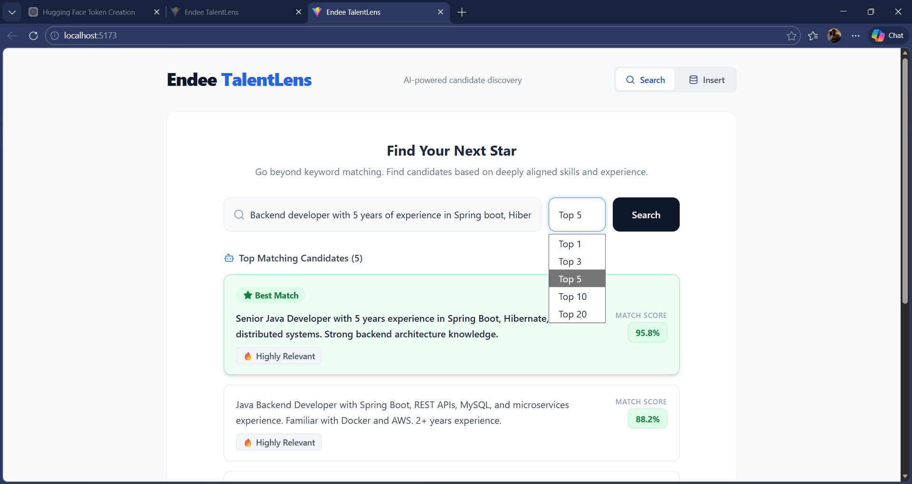
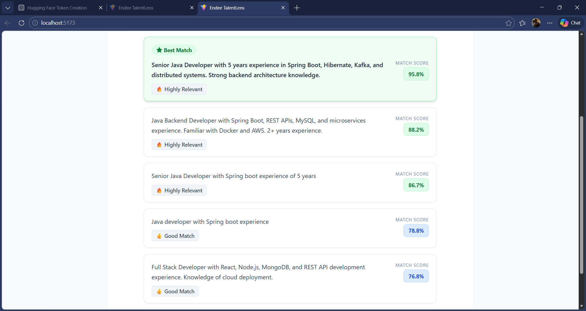

# 🚀 Endee TalentLens – AI Candidate Discovery Platform

An AI-powered full-stack application that enables **semantic candidate search** using vector embeddings. Instead of keyword matching, it retrieves **contextually relevant profiles** using embeddings and vector similarity.

---
## Architecture

* **Frontend**: React + Vite + Tailwind CSS
* **Backend**: Spring Boot 3 + Spring WebFlux
* **Embedding Engine**: HuggingFace Inference API (`all-MiniLM-L6-v2`)
* **Vector Database**: Endee (Docker)

## Prerequisites

Before you begin, ensure you have the following installed on your machine:
1. **Java 17 or higher**: Verify with `java -version`
2. **Node.js 18 or higher**: Verify with `node -v`
3. **Maven**: Verify with `mvn -version`
4. **Docker**: Verify with `docker -v`

---
---

## 🚀 Step-by-Step Setup

### Step 1: Start the Endee Vector Database

Endee needs to be running via Docker before the backend can interact with it.

1. Open a new terminal.
2. Run the Endee Docker container:
   ```bash
   docker run -d --name endee-oss -p 9090:8080 endee/endee:latest
   ```
   *(Note: Adjust the image name `endee/endee:latest` to match the actual Endee Docker image provided by their docs, e.g., `ghcr.io/endee/...` if applicable).*
3. Verify it's running:
   ```bash
   docker ps
   ```
   You should see `endee-oss` in the list.
   
---

### Step 2: Get a HuggingFace API Key

We use HuggingFace's free Inference API to generate embeddings.
1. Go to [HuggingFace](https://huggingface.co/) and create an account.
2. Go to **Settings > Access Tokens**.
3. Create a new token (Read access is fine) and copy it.
---
### Step 3: Run the Spring Boot Backend

1. Open a new terminal and navigate to the backend directory:
   ```bash
   cd e:\endee-semantic-search\backend
   ```
2. Open `src/main/resources/application.properties` in a text editor.
3. Replace the placeholder with your actual HuggingFace API Key:
   ```properties
   embedding.api.key=YOUR_ACTUAL_HUGGINGFACE_TOKEN
   ```
4. Build and start the Spring Boot application using Maven:
   ```bash
   mvn clean install
   mvn spring-boot:run
   ```
5. Wait for the console to print `Started SemanticSearchApplication`. The backend is now running at `http://localhost:8080`.
6. **Test the Backend Health:** Open your browser and go to `http://localhost:8080/api/health`. You should see a success message.
---
### Step 4: Run the React Frontend

1. Open a *third* terminal window and navigate to the frontend directory:
   ```bash
   cd e:\endee-semantic-search\frontend
   ```
2. Install the necessary Node dependencies:
   ```bash
   npm install
   ```
3. Start the Vite development server:
   ```bash
   npm run dev
   ```
4. The terminal will show a local URL, typically `http://localhost:5173`. Open this URL in your web browser.

---
---

## 📸 Practical Working Demo

### 🔹 Insert Candidate (Storing Data)


👉 User enters candidate profile → system converts to embedding → stores in Endee Vector DB.

---

### 🔹 Search Candidate (Semantic Retrieval)


👉 User searches using natural language → system retrieves most relevant candidates using vector similarity.

---

### 🔹 Best Match Highlight


👉 Top result is highlighted with highest similarity score, helping recruiters identify the best candidate quickly.

---
---

## 🧠 End-to-End Testing Flow

Now that everything is running, let's test the flow!

### 1. Insert Data (Store your knowledge)
1. In the Web UI, click the **Insert** tab.
2. Type a text snippet. Example: *"I am a Senior Java Spring Boot developer with 5 years of experience building microservices."*
3. Click "Insert Vector".
   - **What happens behind the scenes:** The React UI sends the text to Spring Boot -> Spring Boot calls HuggingFace to get an embedding array (e.g., `[0.12, -0.05, ...]`) -> Spring Boot stores the vector and text in the Endee Database.

### 2. Search Data (Find similar concepts)
1. In the Web UI, click the **Search** tab.
2. Type a conceptual query. Example: *"Backend Java Engineer"*
3. Click "Search".
   - **What happens behind the scenes:** Spring Boot gets the embedding for your search query -> Asks Endee to find the closest vectors mathematically -> Returns the top 5 matches.
4. You will see your original text snippet appear in the search results with a high similarity score, even though the exact words don't match!

---

