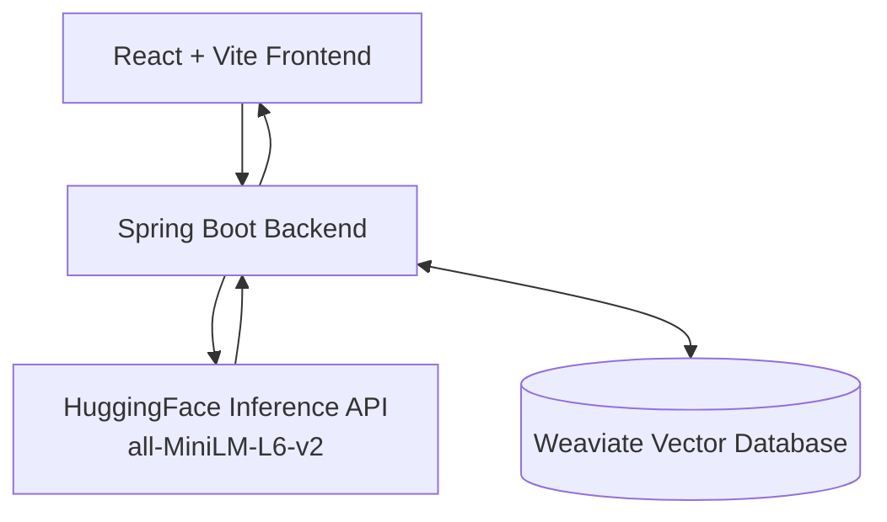

# 🚀 Endee TalentLens · AI Candidate Discovery Platform

[](LICENSE)
[](#backend)
[](#frontend)
[](#vector-database)

**Endee TalentLens** is an AI-powered semantic search platform that finds candidate profiles using **vector embeddings** instead of traditional keyword matching. It converts text into meaningful vector representations and retrieves contextually relevant results using similarity search.

---

## 📚 Table of Contents

- [Architecture Overview](#-architecture-overview)
- [Features](#-features)
- [Tech Stack](#-tech-stack)
- [Prerequisites](#-prerequisites)
- [Quick Start](#-quick-start)
- [End-to-End Flow](#-end-to-end-flow)
- [Screenshots](#-screenshots)
- [Troubleshooting](#-troubleshooting)
- [Author](#-author)

---

## 🧱 Architecture Overview



**Flow**: User → Frontend → Spring Boot → HuggingFace (embeddings) → Weaviate (vector storage & similarity search) → Ranked results.

---

## ✨ Features

- Semantic search using vector embeddings
- Store candidate profiles as vectors
- Retrieve results based on meaning, not exact keywords
- Similarity scoring and best match highlighting
- Clean, responsive user interface
- Easy local setup with Docker

---

## 🧰 Tech Stack

| Layer          | Technology                          |
|----------------|-------------------------------------|
| **Frontend**   | React + Vite + Tailwind CSS         |
| **Backend**    | Spring Boot 3 (Java 17)             |
| **Embeddings** | HuggingFace Inference API (`all-MiniLM-L6-v2`) |
| **Vector DB**  | Weaviate (Docker)                   |

---

## ✅ Prerequisites

| Tool       | Verification Command     |
|------------|--------------------------|
| Java 17    | `java -version`          |
| Node.js    | `node -v`                |
| Maven      | `mvn -version`           |
| Docker     | `docker -v`              |

---

## ⚡ Quick Start

### 1. Start the Vector Database

```bash
docker run -d --name endee-oss -p 9090:8080 semitechnologies/weaviate:latest
```

Verify it's running:
```bash
docker ps
```

### 2. Add HuggingFace API Key

1. Go to [Hugging Face](https://huggingface.co/settings/tokens) and create a **Read** access token.
2. Edit the file: `backend/src/main/resources/application.properties`
3. Add your token:

```properties
embedding.api.key=YOUR_HUGGINGFACE_TOKEN_HERE
```

### 3. Run the Backend

```bash
cd backend
mvn clean install
mvn spring-boot:run
```

The backend will be available at **http://localhost:8080**.  
Test it by visiting: `http://localhost:8080/api/health`

### 4. Run the Frontend

Open a new terminal:

```bash
cd frontend
npm install
npm run dev
```

Frontend will be available at **http://localhost:5173** (or the URL shown in the terminal).

---

## 🧪 End-to-End Flow

### 🔹 Insert Candidate
1. Go to the **Insert** tab in the UI.
2. Enter a candidate profile (e.g., *"I am a Senior Java Spring Boot developer with 5 years of experience building microservices."*)
3. Click **Insert Vector**.
4. The text is converted to an embedding via HuggingFace and stored in Weaviate.

### 🔹 Semantic Search
1. Go to the **Search** tab.
2. Enter a natural language query (e.g., *"Backend Java Engineer"*).
3. Click **Search**.
4. The system generates an embedding for the query, performs vector similarity search, and returns ranked results with similarity scores.

---

## 🧠 How Similarity Works
Results are ranked using cosine similarity between embedding vectors generated via HuggingFace.

---

## 📸 Screenshots

### Insert Candidate


### Search Results


### Best Match Highlight


---

## 🆘 Troubleshooting

| Issue                        | Solution                                      |
|-----------------------------|-----------------------------------------------|
| Docker container not running | Run `docker start endee-oss` or check port 9090 |
| HuggingFace API error (401)  | Verify your API key in `application.properties` |
| No search results            | Make sure you have inserted data first        |
| Backend fails to start       | Check Maven build and Java version            |
| Frontend not loading         | Run `npm install` again and check port 5173   |

---

## 👨‍💻 Author

**Soubhagya Wali**  
Full Stack Developer (Java(Spring Boot) + React)

---

**Happy semantic searching!** 🎯

If you improve this project or add new features, feel free to contribute.
